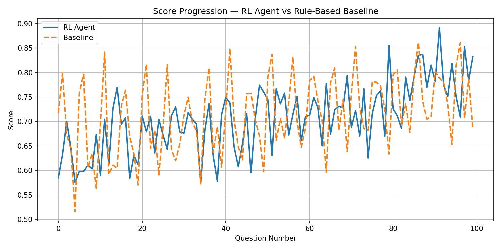
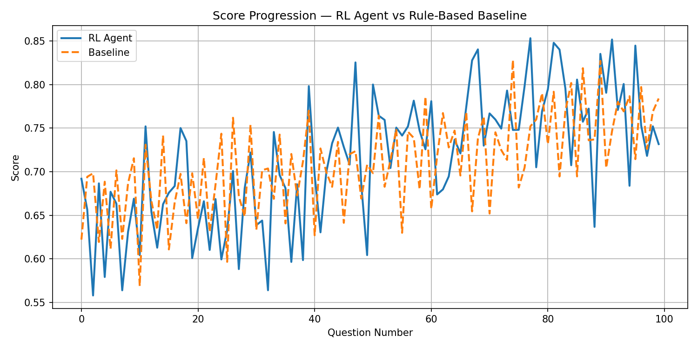

<h2> <b>  Results for REINFORCE with regularization :  </h2>
<h3> Policy network</h3>
```python 
self.input_size  = num_topics * 7 
self.fc1         = nn.Linear(self.input_size, hidden_size1)
self.fc2         = nn.Linear(hidden_size1, hidden_size2)
self.fc3         = nn.Linear(hidden_size2, num_actions)
self.dropout     = nn.Dropout(dropout)
```
<h3> <b> Reward_weights </h3>
weight_improvement = 0.4, weight_coverage_penalty = 0.5, weight_mastery_penalty = 0.1

## Results:
## Attempt 1:


## Attempt 2:
